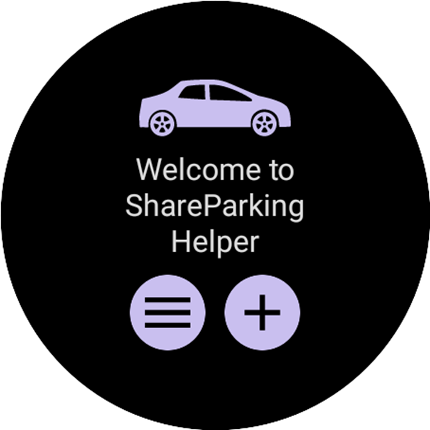
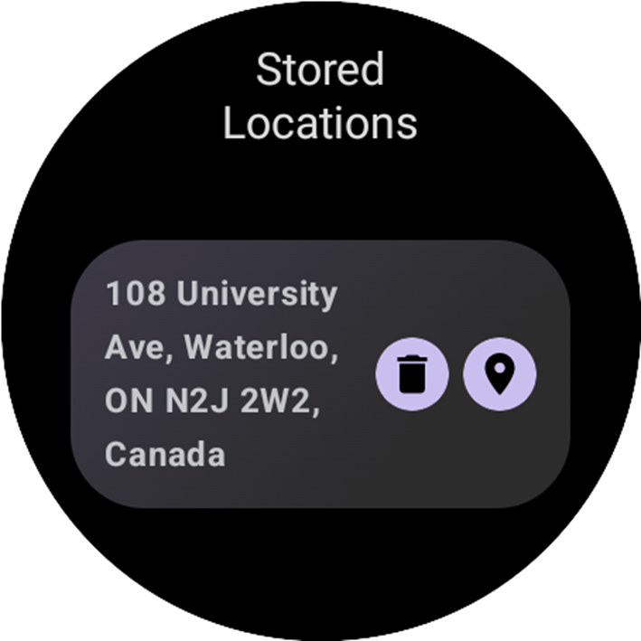
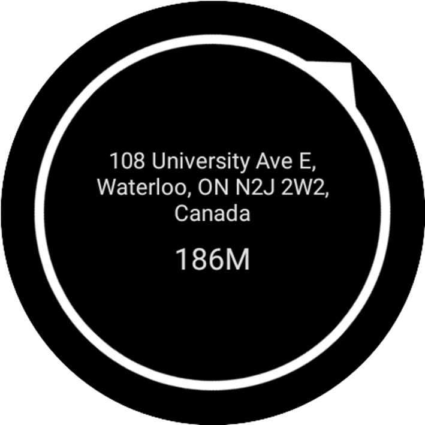

# PROG8790-24W-Sec3-Android-Wear-Final-Project-Compass-Navigator
The WearOS app aims to address a common need  among users by providing a convenient solution for remembering and navigating to parked  car locations.

## Preview

## Project Proposal

[Final Group Project Proposal.pdf](./doc/Final Group Project Proposal.pdf)

## Core Functionality

[Android GPS Update Coordinates Code](https://sliu9412.notion.site/Android-GPS-Update-Coordinates-Code-03b0b368c5e645fb873447ad17b403f1?pvs=4)
